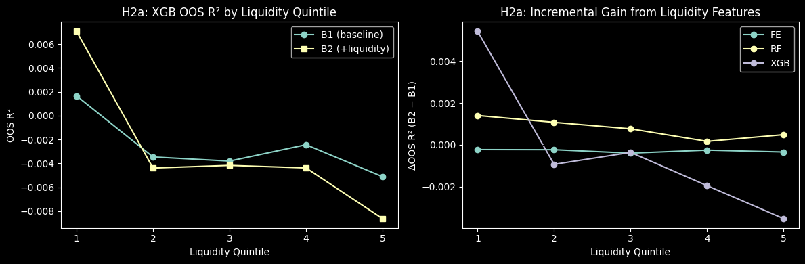
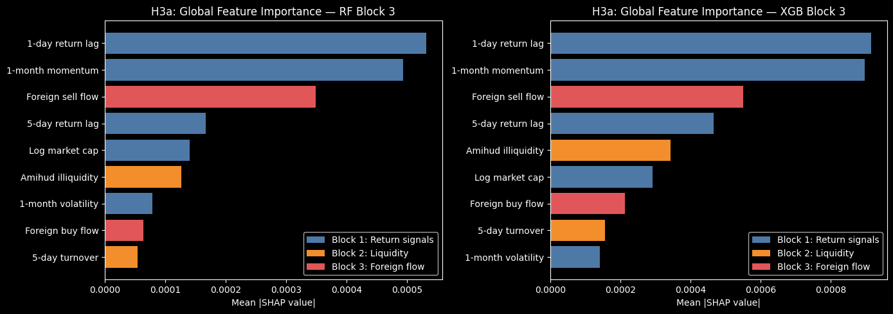
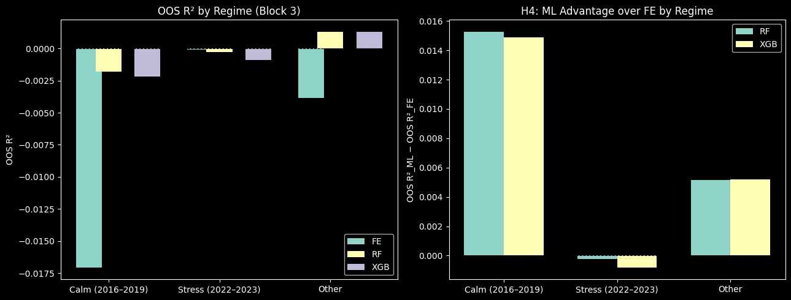
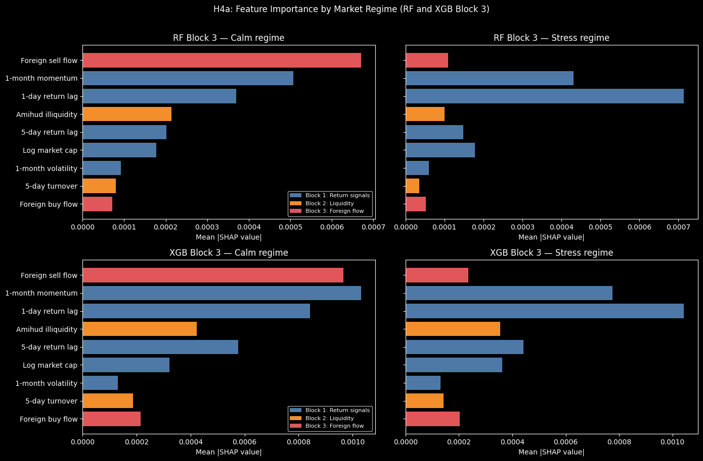

# Notebook 4: Hypothesis Testing and Evaluation

**Input:** `predictions.csv`, `shap_rf_b3.csv`, `regime_labels.csv`,
`h2a_results.csv`, `h2a_compare.csv`, `h4_regime_results.csv`, `h4_regime_advantage.csv`

**Output:** result tables printed per section, charts saved as PNG, summary in `summary_table.csv`

**Purpose:** Evaluate all eight hypotheses using pre-computed predictions and SHAP values
from Notebook 3. No model re-training occurs here.


```python
import pandas as pd
import numpy as np
import warnings
warnings.filterwarnings("ignore")

import statsmodels.api as sm
import matplotlib.pyplot as plt
from matplotlib.patches import Patch
```

## 4.1 Setup and Data Loading


```python
# Main prediction panel — one row per (ticker, week), 97,976 rows
pred = pd.read_csv("output/intermediate/predictions.csv")
pred["date"] = pd.to_datetime(pred["date"])

# Weekly regime labels — 514 weeks
regime_labels = pd.read_csv("output/intermediate/regime_labels.csv")
regime_labels["date"] = pd.to_datetime(regime_labels["date"])
pred = pred.merge(regime_labels, on="date", how="left")

# SHAP values for RF Block 3 and XGB Block 3 — same rows as pred
# regime column is already attached by Notebook 3, no extra merge needed
shap_rf = pd.read_csv("output/intermediate/shap_rf_b3.csv")
shap_rf["date"] = pd.to_datetime(shap_rf["date"])

shap_xgb = pd.read_csv("output/intermediate/shap_xgb_b3.csv")
shap_xgb["date"] = pd.to_datetime(shap_xgb["date"])

# H2a quintile results — from Notebook 3 expanding window per quintile
h2a_results = pd.read_csv("output/intermediate/h2a_results.csv")
h2a_compare = pd.read_csv("output/intermediate/h2a_compare.csv")   # B1 vs B2 per quintile per model

# H4 regime results — Block 3 OOS R² per regime
h4_regime    = pd.read_csv("output/intermediate/h4_regime_results.csv")
h4_advantage = pd.read_csv("output/intermediate/h4_regime_advantage.csv")  # ML advantage over FE

# Store actual returns and dates for later performance calculations
actual = pred["actual"].values
dates  = pred["date"].values

# Feature list used in the full Block 3 model
FEATURE_COLS = ["ret_1d_lag", "ret_5d_lag", "momentum_1m", "volatility_1m",
                "log_size", "turnover_5d", "amihud_5d", "f_buy_5d", "f_sell_5d"]

# Clean variable names for tables and figures
LABEL_MAP = {
    "ret_1d_lag":    "1-day return lag",    "ret_5d_lag":    "5-day return lag",
    "momentum_1m":   "1-month momentum",    "volatility_1m": "1-month volatility",
    "log_size":      "Log market cap",      "turnover_5d":   "5-day turnover",
    "amihud_5d":     "Amihud illiquidity",  "f_buy_5d":      "Foreign buy flow",
    "f_sell_5d":     "Foreign sell flow",
}

# Assign colors by feature block for SHAP plots
BLOCK_COLORS = {
    "ret_1d_lag": "#4e79a7", "ret_5d_lag": "#4e79a7",
    "momentum_1m": "#4e79a7", "volatility_1m": "#4e79a7", "log_size": "#4e79a7",
    "turnover_5d": "#f28e2b", "amihud_5d": "#f28e2b",
    "f_buy_5d": "#e15759",   "f_sell_5d": "#e15759",
}

# Legend labels for the three feature blocks
LEGEND_ELEMENTS = [
    Patch(facecolor="#4e79a7", label="Block 1: Return signals"),
    Patch(facecolor="#f28e2b", label="Block 2: Liquidity"),
    Patch(facecolor="#e15759", label="Block 3: Foreign flow"),
]

print("Prediction panel:", pred.shape)
print("OOS weeks:", pred["date"].nunique(), "| tickers:", pred["ticker"].nunique())
print("Regime (weeks):", regime_labels["regime"].value_counts().to_dict())
print("SHAP RF panel:", shap_rf.shape,  "| regime col:", "regime" in shap_rf.columns)
print("SHAP XGB panel:", shap_xgb.shape, "| regime col:", "regime" in shap_xgb.columns)
```

    Prediction panel: (97976, 13)
    OOS weeks: 514 | tickers: 216
    Regime (weeks): {'calm': 207, 'other': 204, 'stress': 103}
    SHAP RF panel: (97976, 12) | regime col: True
    SHAP XGB panel: (97976, 12) | regime col: True


## 4.2 Helper Functions

`oos_r2` follows Gu et al. (2020): OOS R² = 1 − SSE_model / SSE_benchmark, where
the benchmark is the unconditional OOS mean of actual returns — consistent with
Notebook 3.

`dm_test` implements Diebold-Mariano (1995) for comparing two non-nested models.
Loss differentials are aggregated to the weekly level first (514 observations), then
tested using Newey-West HAC standard errors with 4 lags to account for autocorrelation.
A positive DM statistic means model 2 has lower MSE than model 1.


```python
# Compute OOS R² against the historical mean benchmark
def oos_r2(actual, predicted):
    """OOS R² relative to historical mean benchmark (Gu et al. 2020)."""
    bench     = np.full_like(actual, actual.mean())
    sse_model = np.sum((actual - predicted) ** 2)
    sse_bench = np.sum((actual - bench)     ** 2)
    return 1 - sse_model / sse_bench


# Compute mean absolute prediction error
def mae(actual, predicted):
    return np.mean(np.abs(actual - predicted))


# Compute root mean squared prediction error
def rmse(actual, predicted):
    return np.sqrt(np.mean((actual - predicted) ** 2))


# Run Diebold-Mariano test to compare two models' forecast accuracy
def dm_test(actual, pred1, pred2, dates, n_lags=4):
    """
    Diebold-Mariano test.
    d_t = weekly_MSE(model1) − weekly_MSE(model2)
    Positive stat → model 2 is better (lower MSE).
    Returns (stat, p_two_sided).
    """
    df_tmp = pd.DataFrame({
        "date": dates,
        "e1_sq": (actual - pred1) ** 2,
        "e2_sq": (actual - pred2) ** 2,
    })
    weekly = df_tmp.groupby("date")[["e1_sq", "e2_sq"]].mean().reset_index()
    d = (weekly["e1_sq"] - weekly["e2_sq"]).values
    res = sm.OLS(d, np.ones(len(d))).fit(
        cov_type="HAC", cov_kwds={"maxlags": n_lags}, use_t=False
    )
    return float(res.tvalues[0]), float(res.pvalues[0])


# Convert p-values into APA-style significance stars
def stars(p):
    """APA 7 significance stars: max 3 stars, no 4-star notation."""
    if p < 0.001: return "***"
    if p < 0.01:  return "**"
    if p < 0.05:  return "*"
    return ""


# Interpret whether the DM test supports the expected direction
def dm_verdict(dm_stat, p_dm, alpha=0.05):
    """
    Correct verdict for a DM test where a positive stat means 'hypothesis supported'.
    Checks both significance AND direction — a significant but negative result is
    not support, it is evidence in the opposite direction.
    """
    if p_dm >= alpha:
        return "not supported"
    return "supported" if dm_stat > 0 else "significantly violated"


print("Helper functions loaded.")
```

    Helper functions loaded.


## 4.3 H1: ML Models vs Fixed Effects

**H1:** Tree-based ML models (RF, XGB) achieve higher OOS forecasting accuracy than
linear Fixed Effects.

A metrics table is shown for all 9 model-block combinations (OOS R², MAE, RMSE).
Diebold-Mariano tests then compare FE vs RF and FE vs XGB within each feature block.
A positive DM statistic means the ML model has lower MSE than FE.


```python
print("H1: OOS metrics — all model-block combinations")
print(f"{'Model':<6} {'Block':<6} {'OOS R²':>8} {'MAE':>10} {'RMSE':>10}")

# Store OOS R², MAE, and RMSE for each model-block combination
metrics_rows = []
for model in ["fe", "rf", "xgb"]:
    for block in ["b1", "b2", "b3"]:
        col = f"pred_{model}_{block}"
        r2  = oos_r2(actual, pred[col].values)
        m   = mae(actual, pred[col].values)
        r   = rmse(actual, pred[col].values)
        metrics_rows.append({"model": model.upper(), "block": block.upper(),
                              "oos_r2": r2, "mae": m, "rmse": r})
        print(f"{model.upper():<6} {block.upper():<6} {r2:>8.4f} {m:>10.6f} {r:>10.6f}")

metrics_df = pd.DataFrame(metrics_rows)

print()
print("H1: Diebold-Mariano test — FE vs ML (positive stat = ML is better)")
print(f"{'Block':<6} {'Comparison':<15} {'DM stat':>8} {'p-value':>8}  sig")

# Store DM test results comparing FE with each ML model
h1_rows = []
for block in ["B1", "B2", "B3"]:
    b = block.lower()
    fe_pred = pred[f"pred_fe_{b}"].values
    for ml_name, ml_pred in [
        ("RF",  pred[f"pred_rf_{b}"].values),
        ("XGB", pred[f"pred_xgb_{b}"].values),
    ]:
        stat, pval = dm_test(actual, fe_pred, ml_pred, dates)
        sig = stars(pval)
        print(f"{block:<6} FE vs {ml_name:<9} {stat:>8.3f} {pval:>8.4f}  {sig}")
        h1_rows.append({"block": block, "comparison": f"FE vs {ml_name}",
                        "dm_stat": stat, "p_dm": pval})

h1_df = pd.DataFrame(h1_rows)
```

    H1: OOS metrics — all model-block combinations
    Model  Block    OOS R²        MAE       RMSE
    FE     B1      -0.0068   0.035885   0.049784
    FE     B2      -0.0069   0.035888   0.049787
    FE     B3      -0.0071   0.035891   0.049791
    RF     B1       0.0000   0.035714   0.049616
    RF     B2       0.0000   0.035711   0.049615
    RF     B3      -0.0001   0.035722   0.049619
    XGB    B1      -0.0000   0.035725   0.049617
    XGB    B2       0.0001   0.035732   0.049614
    XGB    B3      -0.0004   0.035731   0.049626
    
    H1: Diebold-Mariano test — FE vs ML (positive stat = ML is better)
    Block  Comparison       DM stat  p-value  sig
    B1     FE vs RF           5.503   0.0000  ***
    B1     FE vs XGB          5.371   0.0000  ***
    B2     FE vs RF           5.818   0.0000  ***
    B2     FE vs XGB          5.704   0.0000  ***
    B3     FE vs RF           5.830   0.0000  ***
    B3     FE vs XGB          5.613   0.0000  ***


## 4.4 H2: Liquidity Features — Incremental Predictive Power

**H2:** Liquidity and microstructure variables provide incremental OOS predictive power
for short-horizon stock returns (Block 2 vs Block 1).

OOS R² is compared between Block 1 (baseline: return signals only) and Block 2
(+turnover, Amihud illiquidity). A positive delta means liquidity features help.
DM tests confirm whether the improvement is statistically significant.


```python
print("H2: Block 2 vs Block 1 — incremental value of liquidity features")
print(f"{'Model':<6} {'OOS R² B1':>10} {'OOS R² B2':>10} {'Δ (B2−B1)':>10} {'DM stat':>8} {'p-value':>8}  sig")

# Store liquidity increment results by comparing Block 2 against Block 1
h2_rows = []
for model in ["fe", "rf", "xgb"]:
    p1 = pred[f"pred_{model}_b1"].values
    p2 = pred[f"pred_{model}_b2"].values
    r2_b1 = oos_r2(actual, p1)
    r2_b2 = oos_r2(actual, p2)
    delta = r2_b2 - r2_b1
    stat, pval = dm_test(actual, p1, p2, dates)   # positive → B2 better
    sig = stars(pval)
    print(f"{model.upper():<6} {r2_b1:>10.4f} {r2_b2:>10.4f} {delta:>10.4f} {stat:>8.3f} {pval:>8.4f}  {sig}")
    h2_rows.append({"model": model.upper(), "oos_r2_b1": r2_b1, "oos_r2_b2": r2_b2,
                    "delta": delta, "dm_stat": stat, "p_dm": pval})

h2_df = pd.DataFrame(h2_rows)
h2_df.to_csv("output/results/h2_results.csv", index=False)
print("\nSaved: h2_results.csv")
```

    H2: Block 2 vs Block 1 — incremental value of liquidity features
    Model   OOS R² B1  OOS R² B2  Δ (B2−B1)  DM stat  p-value  sig
    FE        -0.0068    -0.0069    -0.0001   -0.849   0.3958  
    RF         0.0000     0.0000     0.0000    0.232   0.8169  
    XGB       -0.0000     0.0001     0.0001    0.286   0.7750  
    
    Saved: h2_results.csv


## 4.5 H2a: Liquidity Quintile Heterogeneity

**H2a:** The predictive contribution of liquidity variables is stronger among structurally
illiquid stocks.

Stocks are sorted into five quintiles by time-series average Amihud illiquidity.
The B2−B1 delta in OOS R² should increase monotonically from Quintile 1 (most liquid)
to Quintile 5 (least liquid), if liquidity features capture genuine illiquidity premia.

Results come from `h2a_compare.csv` — the expanding window was re-run separately per
quintile in Notebook 3.


```python
print("H2a: B2−B1 delta OOS R² by liquidity quintile")
print("(Quintile 1 = most liquid, Quintile 5 = least liquid)")
print()

# Pivot delta by quintile and model
pivot = h2a_compare.pivot(index="quintile", columns="model", values="delta_oos_r2")
print(pivot.round(4).to_string())

# Monotonicity check for XGB (our best model)
xgb_delta = pivot["XGB"].values
monotone   = all(xgb_delta[i] <= xgb_delta[i+1] for i in range(len(xgb_delta)-1))
print(f"\nXGB delta monotonically increasing Q1→Q5: {monotone}")

# Chart
fig, axes = plt.subplots(1, 2, figsize=(12, 4))

# Left: OOS R² for B1 and B2 (XGB)
xgb_b1 = h2a_compare[h2a_compare["model"] == "XGB"].sort_values("quintile")
axes[0].plot(xgb_b1["quintile"], xgb_b1["oos_r2_b1"], marker="o", label="B1 (baseline)")
axes[0].plot(xgb_b1["quintile"], xgb_b1["oos_r2_b2"], marker="s", label="B2 (+liquidity)")
axes[0].axhline(0, color="black", linewidth=0.8, linestyle="--")
axes[0].set_xlabel("Liquidity Quintile")
axes[0].set_ylabel("OOS R²")
axes[0].set_title("H2a: XGB OOS R² by Liquidity Quintile")
axes[0].legend()
axes[0].set_xticks([1, 2, 3, 4, 5])

# Right: B2-B1 delta for all models
for model_name in ["FE", "RF", "XGB"]:
    sub = h2a_compare[h2a_compare["model"] == model_name].sort_values("quintile")
    axes[1].plot(sub["quintile"], sub["delta_oos_r2"], marker="o", label=model_name)
axes[1].axhline(0, color="black", linewidth=0.8, linestyle="--")
axes[1].set_xlabel("Liquidity Quintile")
axes[1].set_ylabel("ΔOOS R² (B2 − B1)")
axes[1].set_title("H2a: Incremental Gain from Liquidity Features")
axes[1].legend()
axes[1].set_xticks([1, 2, 3, 4, 5])

plt.tight_layout()
plt.savefig("output/figures/h2a_quintile_chart.png", dpi=150, bbox_inches="tight")
plt.show()
print("Saved: h2a_quintile_chart.png")
```

    H2a: B2−B1 delta OOS R² by liquidity quintile
    (Quintile 1 = most liquid, Quintile 5 = least liquid)
    
    model         FE      RF     XGB
    quintile                        
    1        -0.0002  0.0014  0.0054
    2        -0.0002  0.0011 -0.0009
    3        -0.0004  0.0008 -0.0004
    4        -0.0003  0.0002 -0.0019
    5        -0.0003  0.0005 -0.0035
    
    XGB delta monotonically increasing Q1→Q5: False


    

    


    Saved: h2a_quintile_chart.png


## 4.6 H3: Foreign Flow Features — Incremental Predictive Power

**H3:** Normalized foreign buying and selling flows provide incremental OOS predictive
power for short-horizon stock returns (Block 3 vs Block 2).

Same structure as H2: OOS R² delta and DM test comparing Block 2 (baseline + liquidity)
against Block 3 (+ foreign buy/sell flow).


```python
print("H3: Block 3 vs Block 2 — incremental value of foreign flow features")
print(f"{'Model':<6} {'OOS R² B2':>10} {'OOS R² B3':>10} {'Δ (B3−B2)':>10} {'DM stat':>8} {'p-value':>8}  sig")

# Store foreign flow increment results by comparing Block 3 against Block 2
h3_rows = []
for model in ["fe", "rf", "xgb"]:
    p2 = pred[f"pred_{model}_b2"].values
    p3 = pred[f"pred_{model}_b3"].values
    r2_b2 = oos_r2(actual, p2)
    r2_b3 = oos_r2(actual, p3)
    delta = r2_b3 - r2_b2
    stat, pval = dm_test(actual, p2, p3, dates)   # positive → B3 better
    sig = stars(pval)
    print(f"{model.upper():<6} {r2_b2:>10.4f} {r2_b3:>10.4f} {delta:>10.4f} {stat:>8.3f} {pval:>8.4f}  {sig}")
    h3_rows.append({"model": model.upper(), "oos_r2_b2": r2_b2, "oos_r2_b3": r2_b3,
                    "delta": delta, "dm_stat": stat, "p_dm": pval})

h3_df = pd.DataFrame(h3_rows)
h3_df.to_csv("output/results/h3_results.csv", index=False)
print("\nSaved: h3_results.csv")
```

    H3: Block 3 vs Block 2 — incremental value of foreign flow features
    Model   OOS R² B2  OOS R² B3  Δ (B3−B2)  DM stat  p-value  sig
    FE        -0.0069    -0.0071    -0.0001   -1.169   0.2422  
    RF         0.0000    -0.0001    -0.0002   -0.918   0.3584  
    XGB        0.0001    -0.0004    -0.0005   -1.116   0.2645  
    
    Saved: h3_results.csv


## 4.7 H3a: Asymmetry between Foreign Selling and Buying

**H3a:** The predictive power of foreign trading flows is asymmetric, with foreign selling
providing stronger incremental predictive power than foreign buying.

Tested using mean absolute SHAP values from both the RF Block 3 and XGB Block 3 models.
A higher mean |SHAP| for `f_sell_5d` relative to `f_buy_5d` indicates that foreign selling
is the more informative signal. Global importance is shown for all features for both models
to provide a complete picture of feature contributions.

Note: FE coefficient comparison is omitted here — it would require saving 514 × 210
coefficient vectors from the expanding window, which adds significant complexity for
minimal added insight. This is noted as a limitation in the thesis.


```python
print("H3a: SHAP importance — foreign sell vs foreign buy (RF and XGB Block 3)")

shap_results = {}   # will store sell_shap, buy_shap per model for summary cell

fig, axes = plt.subplots(1, 2, figsize=(14, 5))

for ax, (model_name, shap_data) in zip(axes, [("RF", shap_rf), ("XGB", shap_xgb)]):

    # Global mean |SHAP| per feature
    global_imp = shap_data[FEATURE_COLS].abs().mean().sort_values(ascending=False).reset_index()
    global_imp.columns = ["feature", "mean_abs_shap"]

    sell_shap = global_imp.loc[global_imp["feature"] == "f_sell_5d", "mean_abs_shap"].values[0]
    buy_shap  = global_imp.loc[global_imp["feature"] == "f_buy_5d",  "mean_abs_shap"].values[0]
    shap_results[model_name] = {"sell": sell_shap, "buy": buy_shap,
                                 "ratio": sell_shap / buy_shap,
                                 "global_imp": global_imp}

    print(f"\n--- {model_name} Block 3 ---")
    print(global_imp.to_string(index=False))
    print(f"f_sell_5d mean |SHAP|: {sell_shap:.6f}")
    print(f"f_buy_5d  mean |SHAP|: {buy_shap:.6f}")
    verdict = "f_sell > f_buy (H3a SUPPORTED)" if sell_shap > buy_shap else "f_buy >= f_sell (H3a NOT SUPPORTED)"
    print(f"Sell/buy ratio: {sell_shap/buy_shap:.2f}x  →  {verdict}")

    # Save per-model importance CSV
    global_imp.to_csv(f"output/results/h3a_shap_importance_{model_name.lower()}.csv", index=False)

    # Bar chart (block color-coded)
    features_ord = global_imp["feature"].tolist()
    values_ord   = global_imp["mean_abs_shap"].tolist()
    colors = [BLOCK_COLORS[f] for f in features_ord]
    labels = [LABEL_MAP[f] for f in features_ord]

    ax.barh(labels[::-1], values_ord[::-1], color=colors[::-1])
    ax.set_xlabel("Mean |SHAP value|")
    ax.set_title(f"H3a: Global Feature Importance — {model_name} Block 3")
    ax.legend(handles=LEGEND_ELEMENTS, loc="lower right")

plt.tight_layout()
plt.savefig("output/figures/h3a_global_shap.png", dpi=150, bbox_inches="tight")
plt.show()

# Expose RF values as top-level variables for use in the summary cell (RF is primary model)
sell_shap_rf  = shap_results["RF"]["sell"]
buy_shap_rf   = shap_results["RF"]["buy"]
sell_shap_xgb = shap_results["XGB"]["sell"]
buy_shap_xgb  = shap_results["XGB"]["buy"]

print(f"\nSaved: h3a_global_shap.png | h3a_shap_importance_rf.csv | h3a_shap_importance_xgb.csv")
```

    H3a: SHAP importance — foreign sell vs foreign buy (RF and XGB Block 3)
    
    --- RF Block 3 ---
          feature  mean_abs_shap
       ret_1d_lag       0.000531
      momentum_1m       0.000494
        f_sell_5d       0.000348
       ret_5d_lag       0.000166
         log_size       0.000140
        amihud_5d       0.000126
    volatility_1m       0.000079
         f_buy_5d       0.000063
      turnover_5d       0.000054
    f_sell_5d mean |SHAP|: 0.000348
    f_buy_5d  mean |SHAP|: 0.000063
    Sell/buy ratio: 5.49x  →  f_sell > f_buy (H3a SUPPORTED)
    
    --- XGB Block 3 ---
          feature  mean_abs_shap
       ret_1d_lag       0.000915
      momentum_1m       0.000897
        f_sell_5d       0.000550
       ret_5d_lag       0.000466
        amihud_5d       0.000344
         log_size       0.000293
         f_buy_5d       0.000213
      turnover_5d       0.000156
    volatility_1m       0.000142
    f_sell_5d mean |SHAP|: 0.000550
    f_buy_5d  mean |SHAP|: 0.000213
    Sell/buy ratio: 2.58x  →  f_sell > f_buy (H3a SUPPORTED)


    

    


    
    Saved: h3a_global_shap.png | h3a_shap_importance_rf.csv | h3a_shap_importance_xgb.csv


## 4.7a H3a Signed: Signed SHAP by Foreign Flow Quintile

Mean *signed* SHAP values (not absolute) across foreign flow quintiles.
Quintiles are formed within each week using the rank-normalized feature values
that were passed to the model.


```python
print("H3a: Signed SHAP by foreign flow quintiles")

# Load the rank-normalized foreign flow values that were used as model inputs
# (model_ready.csv is not loaded earlier in this notebook)
feature_values = pd.read_csv(
    "output/intermediate/model_ready.csv",
    usecols=["ticker", "date", "f_buy_5d", "f_sell_5d"]
)
feature_values["date"] = pd.to_datetime(feature_values["date"])

def signed_shap_by_quintile(shap_df, model_name):
    """
    Compute average signed SHAP values across foreign flow quintiles.
    Quintiles are formed within each week using the model-input flow ranks.
    """

    # Merge SHAP values with the corresponding foreign flow feature values
    # suffixes: _shap = SHAP contribution, _value = actual rank-normalized input
    tmp = shap_df.merge(
        feature_values,
        on=["ticker", "date"],
        how="left",
        suffixes=("_shap", "_value")
    )
    rows = []
    # Repeat the same quintile calculation for foreign selling and foreign buying
    for feature in ["f_sell_5d", "f_buy_5d"]:
        value_col = feature + "_value"      # rank-normalized feature value
        shap_col  = feature + "_shap"       # signed SHAP contribution (renamed by merge)
        q_col     = feature + "_quintile"   # quintile label
        # Form weekly quintiles based on the rank-normalized foreign flow value
        tmp[q_col] = (
            tmp.groupby("date")[value_col]
            .transform(lambda x: pd.qcut(
                x.rank(method="first"),
                q=5,
                labels=["Q1", "Q2", "Q3", "Q4", "Q5"]
            ))
        )
        # Average signed SHAP values within each foreign flow quintile
        q_means = tmp.groupby(q_col)[shap_col].mean()
        # Store one result row for each feature and model
        rows.append({
            "model":   model_name,
            "feature": feature,
            "Q1": q_means.loc["Q1"],
            "Q2": q_means.loc["Q2"],
            "Q3": q_means.loc["Q3"],
            "Q4": q_means.loc["Q4"],
            "Q5": q_means.loc["Q5"],
        })
    return pd.DataFrame(rows)

# Apply the signed SHAP quintile calculation to both RF and XGB
h3a_signed = pd.concat([
    signed_shap_by_quintile(shap_rf,  "RF"),
    signed_shap_by_quintile(shap_xgb, "XGB")
], ignore_index=True)

# Save the table used for the H3a signed SHAP interpretation
h3a_signed.to_csv("output/results/h3a_signed_shap_quintiles.csv", index=False)
print(h3a_signed.round(6).to_string(index=False))
print("\nSaved: output/results/h3a_signed_shap_quintiles.csv")
```

    H3a: Signed SHAP by foreign flow quintiles
    model   feature       Q1        Q2        Q3        Q4        Q5
       RF f_sell_5d 0.000811 -0.000094 -0.000186 -0.000183 -0.000177
       RF  f_buy_5d 0.000073 -0.000008 -0.000007 -0.000010 -0.000064
      XGB f_sell_5d 0.001117 -0.000264 -0.000290 -0.000275 -0.000232
      XGB  f_buy_5d 0.000163 -0.000003  0.000009 -0.000004 -0.000325
    
    Saved: output/results/h3a_signed_shap_quintiles.csv


## 4.8 H4: Regime Dependence of the ML Advantage

**H4:** The predictive advantage of tree-based machine learning models over the
linear fixed-effects benchmark is smaller during stress regimes than during calm regimes.

ML advantage is defined as OOS R²_ML − OOS R²_FE within each regime, using Block 3
predictions. H4 is supported if the advantage is lower in the stress regime than in
the calm regime.


```python
print("H4: ML advantage over FE (OOS R² difference) by regime — Block 3")
print()
print(h4_advantage[["regime", "model", "fe_r2", "oos_r2", "ml_advantage"]].to_string(index=False))

# Summary: is the ML advantage smaller in stress than in calm?
print()
for ml in ["RF", "XGB"]:
    sub = h4_advantage[h4_advantage["model"] == ml].set_index("regime")
    calm_adv = sub.loc["calm", "ml_advantage"]
    stress_adv = sub.loc["stress", "ml_advantage"]

    verdict = "supported" if stress_adv < calm_adv else "not supported"
    direction = "smaller in stress" if stress_adv < calm_adv else "not smaller in stress"

    print(
        f"{ml}: calm advantage={calm_adv:+.4f}  "
        f"stress advantage={stress_adv:+.4f}  → {direction}; H4 {verdict}"
    )

# Chart
regimes = ["calm", "stress", "other"]
x = np.arange(len(regimes))
width = 0.35

fig, axes = plt.subplots(1, 2, figsize=(13, 5))

# Left: OOS R² by regime for FE, RF, XGB
for i, model in enumerate(["FE", "RF", "XGB"]):
    sub = h4_regime[h4_regime["model"] == model].set_index("regime")
    vals = [sub.loc[r, "oos_r2"] for r in regimes]
    axes[0].bar(x + (i - 1) * width / 2 + (i == 2) * width / 2, vals,
                width / 1.5, label=model)
axes[0].axhline(0, color="black", linewidth=0.8, linestyle="--")
axes[0].set_xticks(x)
axes[0].set_xticklabels(["Calm (2016–2019)", "Stress (2022–2023)", "Other"])
axes[0].set_ylabel("OOS R²")
axes[0].set_title("OOS R² by Regime (Block 3)")
axes[0].legend()

# Right: ML advantage (R²_ML - R²_FE) by regime
for ml, offset in [("RF", -width/2), ("XGB", width/2)]:
    sub = h4_advantage[h4_advantage["model"] == ml].set_index("regime")
    vals = [sub.loc[r, "ml_advantage"] for r in regimes]
    axes[1].bar(x + offset, vals, width, label=ml)
axes[1].axhline(0, color="black", linewidth=0.8, linestyle="--")
axes[1].set_xticks(x)
axes[1].set_xticklabels(["Calm (2016–2019)", "Stress (2022–2023)", "Other"])
axes[1].set_ylabel("OOS R²_ML − OOS R²_FE")
axes[1].set_title("H4: ML Advantage over FE by Regime")
axes[1].legend()

plt.tight_layout()
plt.savefig("output/figures/h4_regime_chart.png", dpi=150, bbox_inches="tight")
plt.show()
print("Saved: h4_regime_chart.png")
```

    H4: ML advantage over FE (OOS R² difference) by regime — Block 3
    
    regime model     fe_r2    oos_r2  ml_advantage
      calm    RF -0.017070 -0.001794      0.015276
      calm   XGB -0.017070 -0.002198      0.014871
    stress    RF -0.000062 -0.000289     -0.000226
    stress   XGB -0.000062 -0.000877     -0.000815
     other    RF -0.003857  0.001306      0.005163
     other   XGB -0.003857  0.001324      0.005181
    
    RF: calm advantage=+0.0153  stress advantage=-0.0002  → smaller in stress; H4 supported
    XGB: calm advantage=+0.0149  stress advantage=-0.0008  → smaller in stress; H4 supported


    

    


    Saved: h4_regime_chart.png


## 4.9 H4a: Incremental Block Contribution and SHAP by Regime

**H4a:** The incremental predictive contribution of liquidity variables and foreign flow variables
is stronger during stress regimes than during calm regimes.

This is tested two ways. First, OOS R² deltas are computed within each regime: B2−B1
captures the liquidity increment and B3−B2 captures the foreign flow increment for calm,
stress, and other weeks separately. Second, mean absolute SHAP values for liquidity features (turnover, Amihud) and foreign flow features (f_buy, f_sell) are compared across regimes to assess whether their contribution is stronger during stress than during calm periods.


```python
print("H4a Part 1: B2−B1 and B3−B2 OOS R² delta by regime")

# Store regime-level OOS R² and block-to-block incremental gains
h4a_rows = []

# Use full OOS mean as benchmark — consistent with H4 (NB3) and full-sample OOS R²
# actual is the full OOS actual array defined in section 4.1
full_oos_mean = actual.mean()

# Compute regime-specific OOS R² using the full OOS mean benchmark
def r2_full_bench(act_sub, pred_vals):
    sse_m = np.sum((act_sub - pred_vals) ** 2)
    sse_b = np.sum((act_sub - full_oos_mean) ** 2)
    return 1 - sse_m / sse_b

# Loop through each market regime and calculate block-level model performance
for regime in ["calm", "stress", "other"]:
    sub = pred[pred["regime"] == regime]
    act = sub["actual"].values

    for model in ["fe", "rf", "xgb"]:
        r2_b1 = r2_full_bench(act, sub[f"pred_{model}_b1"].values)
        r2_b2 = r2_full_bench(act, sub[f"pred_{model}_b2"].values)
        r2_b3 = r2_full_bench(act, sub[f"pred_{model}_b3"].values)
        h4a_rows.append({
            "regime": regime, "model": model.upper(),
            "oos_r2_b1": r2_b1, "oos_r2_b2": r2_b2, "oos_r2_b3": r2_b3,
            "delta_b2_b1": r2_b2 - r2_b1,
            "delta_b3_b2": r2_b3 - r2_b2,
        })

h4a_df = pd.DataFrame(h4a_rows)
h4a_df.to_csv("output/results/h4a_block_regime_results.csv", index=False)

# Show XGB pivot (clearest story)
pivot_xgb = h4a_df[h4a_df["model"] == "XGB"][["regime", "oos_r2_b1", "oos_r2_b2", "oos_r2_b3", "delta_b2_b1", "delta_b3_b2"]]
print("\nXGB block OOS R\u00b2 and deltas by regime:")
print(pivot_xgb.round(4).to_string(index=False))

print("\nAll models — B2−B1 delta by regime:")
print(h4a_df.pivot_table(index="model", columns="regime", values="delta_b2_b1").round(4).to_string())

print("\nAll models — B3−B2 delta by regime:")
print(h4a_df.pivot_table(index="model", columns="regime", values="delta_b3_b2").round(4).to_string())

print("\nSaved: h4a_block_regime_results.csv")

```

    H4a Part 1: B2−B1 and B3−B2 OOS R² delta by regime
    
    XGB block OOS R² and deltas by regime:
    regime  oos_r2_b1  oos_r2_b2  oos_r2_b3  delta_b2_b1  delta_b3_b2
      calm    -0.0018    -0.0023    -0.0022      -0.0005       0.0001
    stress    -0.0002    -0.0010    -0.0009      -0.0008       0.0001
     other     0.0015     0.0028     0.0013       0.0013      -0.0015
    
    All models — B2−B1 delta by regime:
    regime    calm   other  stress
    model                         
    FE     -0.0001 -0.0002 -0.0002
    RF      0.0000  0.0001 -0.0001
    XGB    -0.0005  0.0013 -0.0008
    
    All models — B3−B2 delta by regime:
    regime    calm   other  stress
    model                         
    FE     -0.0002  0.0000 -0.0003
    RF     -0.0002  0.0001 -0.0004
    XGB     0.0001 -0.0015  0.0001
    
    Saved: h4a_block_regime_results.csv


```python
print("H4a Part 2: SHAP importance of liquidity and flow features by regime (RF and XGB Block 3)")

LIQUIDITY_FEATURES = ["turnover_5d", "amihud_5d"]
FLOW_FEATURES      = ["f_buy_5d", "f_sell_5d"]

# Compute regime SHAP for both models
regime_shap_all = {}   # keyed by model name

for model_name, shap_data in [("RF", shap_rf), ("XGB", shap_xgb)]:
    rows = []
    for regime in ["calm", "stress", "other"]:
        sub = shap_data[shap_data["regime"] == regime][FEATURE_COLS]
        for feat in FEATURE_COLS:
            rows.append({"regime": regime, "feature": feat,
                         "mean_abs_shap": sub[feat].abs().mean()})
    df_model = pd.DataFrame(rows)
    df_model.to_csv(f"output/results/h4a_shap_regime_{model_name.lower()}.csv", index=False)
    regime_shap_all[model_name] = df_model

    print(f"\n--- {model_name} Block 3 ---")
    for regime in ["calm", "stress", "other"]:
        sub  = df_model[df_model["regime"] == regime].set_index("feature")
        liq  = sub.loc[LIQUIDITY_FEATURES,  "mean_abs_shap"].sum()
        flow = sub.loc[FLOW_FEATURES, "mean_abs_shap"].sum()
        print(f"  {regime:<8}  liquidity SHAP={liq:.6f}  foreign flow SHAP={flow:.6f}")

# Use RF as primary regime_shap_df for the summary cell
regime_shap_df = regime_shap_all["RF"]

# Chart: 2×2 grid — calm vs stress for RF and XGB
fig, axes = plt.subplots(2, 2, figsize=(14, 9), sharey=True)

for row_idx, (model_name, shap_df_model) in enumerate([("RF", regime_shap_all["RF"]),
                                                        ("XGB", regime_shap_all["XGB"])]):
    for col_idx, regime in enumerate(["calm", "stress"]):
        ax = axes[row_idx][col_idx]
        sub = shap_df_model[shap_df_model["regime"] == regime].sort_values(
            "mean_abs_shap", ascending=True
        )
        ax.barh(
            [LABEL_MAP[f] for f in sub["feature"]],
            sub["mean_abs_shap"],
            color=[BLOCK_COLORS[f] for f in sub["feature"]]
        )
        ax.set_title(f"{model_name} Block 3 — {regime.capitalize()} regime")
        ax.set_xlabel("Mean |SHAP value|")
        if col_idx == 0:
            ax.legend(handles=LEGEND_ELEMENTS, loc="lower right", fontsize=8)

plt.suptitle("H4a: Feature Importance by Market Regime (RF and XGB Block 3)", y=1.01)
plt.tight_layout()
plt.savefig("output/figures/h4a_shap_by_regime.png", dpi=150, bbox_inches="tight")
plt.show()

print("\nSaved: h4a_shap_by_regime.png | h4a_shap_regime_rf.csv | h4a_shap_regime_xgb.csv")
```

    H4a Part 2: SHAP importance of liquidity and flow features by regime (RF and XGB Block 3)
    
    --- RF Block 3 ---
      calm      liquidity SHAP=0.000294  foreign flow SHAP=0.000743
      stress    liquidity SHAP=0.000136  foreign flow SHAP=0.000161
      other     liquidity SHAP=0.000100  foreign flow SHAP=0.000243
    
    --- XGB Block 3 ---
      calm      liquidity SHAP=0.000608  foreign flow SHAP=0.001179
      stress    liquidity SHAP=0.000497  foreign flow SHAP=0.000439
      other     liquidity SHAP=0.000403  foreign flow SHAP=0.000555


    

    


    
    Saved: h4a_shap_by_regime.png | h4a_shap_regime_rf.csv | h4a_shap_regime_xgb.csv


## 4.10 Summary

Verdict for each hypothesis based on the tests above.
Significance: *** p < .001, ** p < .01, * p < .05 (APA 7)


```python
def dm_verdict(dm_stat, p_dm, alpha=0.05):
    if p_dm >= alpha:
        return "not supported"
    return "supported" if dm_stat > 0 else "significantly violated"


print("HYPOTHESIS SUMMARY")
print("Significance: *** p < .001  ** p < .01  * p < .05  (APA 7)")

# H1: positive DM stat = ML beats FE
print("\nH1: ML outperforms FE (DM test, B3 as main comparison)")
for ml in ["RF", "XGB"]:
    row   = h1_df[(h1_df["comparison"] == f"FE vs {ml}") & (h1_df["block"] == "B3")].iloc[0]
    r2_fe = metrics_df[(metrics_df["model"] == "FE") & (metrics_df["block"] == "B3")]["oos_r2"].values[0]
    r2_ml = metrics_df[(metrics_df["model"] == ml)  & (metrics_df["block"] == "B3")]["oos_r2"].values[0]
    v = dm_verdict(row["dm_stat"], row["p_dm"])
    print(f"  FE vs {ml}: DM={row['dm_stat']:.3f}  p={row['p_dm']:.4f}{stars(row['p_dm'])}"
          f"  OOS R² FE={r2_fe:.4f} {ml}={r2_ml:.4f}  → {v}")

# H2: positive DM stat = B2 beats B1 (liquidity adds value)
print("\nH2: Liquidity features add incremental power (B2 vs B1, positive DM = B2 better)")
for _, row in h2_df.iterrows():
    v = dm_verdict(row["dm_stat"], row["p_dm"])
    print(f"  {row['model']}: Δ={row['delta']:+.4f}  DM={row['dm_stat']:.3f}"
          f"  p={row['p_dm']:.4f}{stars(row['p_dm'])}  → {v}")

# H2a: monotone increase across quintiles — checked for all three models
print("\nH2a: Liquidity gain stronger in illiquid stocks (B2−B1 delta monotone Q1→Q5)")
for model_name in ["FE", "RF", "XGB"]:
    deltas = (h2a_compare[h2a_compare["model"] == model_name]
              .sort_values("quintile")["delta_oos_r2"].tolist())
    mono  = all(deltas[i] <= deltas[i+1] for i in range(len(deltas)-1))
    label = "supported" if mono else "not supported"
    print(f"  {model_name}: {[round(v,4) for v in deltas]}  monotone={mono}  → {label}")

# H3: positive DM stat = B3 beats B2 (foreign flow adds value)
print("\nH3: Foreign flow features add incremental power (B3 vs B2, positive DM = B3 better)")
for _, row in h3_df.iterrows():
    v = dm_verdict(row["dm_stat"], row["p_dm"])
    print(f"  {row['model']}: Δ={row['delta']:+.4f}  DM={row['dm_stat']:.3f}"
          f"  p={row['p_dm']:.4f}{stars(row['p_dm'])}  → {v}")

# H3a: f_sell SHAP > f_buy SHAP — report both RF and XGB
print("\nH3a: Foreign sell more important than foreign buy (SHAP)")
for model_name, s_shap, b_shap in [("RF",  sell_shap_rf,  buy_shap_rf),
                                     ("XGB", sell_shap_xgb, buy_shap_xgb)]:
    verdict = "supported" if s_shap > b_shap else "not supported"
    print(f"  {model_name}: f_sell={s_shap:.6f}  f_buy={b_shap:.6f}"
          f"  ratio={s_shap/b_shap:.2f}x  → {verdict}")

# H4: ML advantage smaller in stress than calm
print("\nH4: ML advantage over FE smaller in stress than calm (Block 3)")
for ml in ["RF", "XGB"]:
    sub = h4_advantage[h4_advantage["model"] == ml].set_index("regime")
    calm_adv = sub.loc["calm", "ml_advantage"]
    stress_adv = sub.loc["stress", "ml_advantage"]
    v = "supported" if stress_adv < calm_adv else "not supported"
    print(f"  {ml}: calm={calm_adv:+.4f}  stress={stress_adv:+.4f}  → {v}")

# H4a: contribution stronger in stress than calm — check OOS delta (XGB) + SHAP (RF and XGB)
print("\nH4a: Liquidity and foreign-flow contribution stronger in stress than calm")
xgb_h4a = h4a_df[h4a_df["model"] == "XGB"].set_index("regime")

b2b1_calm   = xgb_h4a.loc["calm",   "delta_b2_b1"]
b2b1_stress = xgb_h4a.loc["stress", "delta_b2_b1"]
v_liq_oos = "supported" if (b2b1_stress > b2b1_calm) and (b2b1_stress > 0) else "not supported"
print(f"  XGB Liquidity OOS delta (B2−B1): calm={b2b1_calm:+.4f}  stress={b2b1_stress:+.4f}  → {v_liq_oos}")

b3b2_calm   = xgb_h4a.loc["calm",   "delta_b3_b2"]
b3b2_stress = xgb_h4a.loc["stress", "delta_b3_b2"]
v_flow_oos = "supported" if (b3b2_stress > b3b2_calm) and (b3b2_stress > 0) else "not supported"
print(f"  XGB Foreign flow OOS delta (B3−B2): calm={b3b2_calm:+.4f}  stress={b3b2_stress:+.4f}  → {v_flow_oos}")

for model_name in ["RF", "XGB"]:
    df_s = regime_shap_all[model_name]
    regime_liq = df_s[df_s["feature"].isin(LIQUIDITY_FEATURES)].groupby("regime")["mean_abs_shap"].sum()
    regime_flow = df_s[df_s["feature"].isin(FLOW_FEATURES)].groupby("regime")["mean_abs_shap"].sum()
    liq_calm   = regime_liq.get("calm",   0)
    liq_stress = regime_liq.get("stress", 0)
    flow_calm   = regime_flow.get("calm",   0)
    flow_stress = regime_flow.get("stress", 0)
    v_liq_shap  = "supported" if liq_stress  > liq_calm  else "not supported"
    v_flow_shap = "supported" if flow_stress > flow_calm else "not supported"
    print(f"  {model_name} Liquidity SHAP:     calm={liq_calm:.6f}   stress={liq_stress:.6f}   → {v_liq_shap}")
    print(f"  {model_name} Foreign flow SHAP:  calm={flow_calm:.6f}   stress={flow_stress:.6f}   → {v_flow_shap}")

all_verdicts = [v_liq_oos, v_flow_oos]
for model_name in ["RF", "XGB"]:
    df_s = regime_shap_all[model_name]
    regime_liq  = df_s[df_s["feature"].isin(LIQUIDITY_FEATURES)].groupby("regime")["mean_abs_shap"].sum()
    regime_flow = df_s[df_s["feature"].isin(FLOW_FEATURES)].groupby("regime")["mean_abs_shap"].sum()
    all_verdicts.append("supported" if regime_liq.get("stress",0)  > regime_liq.get("calm",0)  else "not supported")
    all_verdicts.append("supported" if regime_flow.get("stress",0) > regime_flow.get("calm",0) else "not supported")

n_sup = all_verdicts.count("supported")
if n_sup == len(all_verdicts):
    h4a_verdict = "supported"
elif n_sup > 0:
    h4a_verdict = "partially supported / mixed evidence"
else:
    h4a_verdict = "not supported"
print(f"  Overall H4a verdict: {h4a_verdict}")

# Save compact hypothesis-level summary CSV
summary_rows = [
    {"hypothesis": "H1",  "test": "DM tests: FE vs RF/XGB, Block 3",
     "verdict": "accepted",  "key_result": "RF and XGB significantly outperform FE in Block 3"},
    {"hypothesis": "H2",  "test": "DM tests: Block 2 vs Block 1",
     "verdict": "rejected",  "key_result": "Liquidity variables do not significantly improve OOS performance"},
    {"hypothesis": "H2a", "test": "B2−B1 OOS R² delta across liquidity quintiles",
     "verdict": "rejected",  "key_result": "Liquidity gains are not monotonic across illiquidity quintiles"},
    {"hypothesis": "H3",  "test": "DM tests: Block 3 vs Block 2",
     "verdict": "rejected",  "key_result": "Foreign flow variables do not provide incremental OOS power"},
    {"hypothesis": "H3a", "test": "Mean absolute SHAP: foreign sell vs foreign buy (RF and XGB)",
     "verdict": "accepted",
     "key_result": (f"RF sell/buy ratio={sell_shap_rf/buy_shap_rf:.2f}x; "
                    f"XGB sell/buy ratio={sell_shap_xgb/buy_shap_xgb:.2f}x")},
    {"hypothesis": "H4",  "test": "ML advantage over FE in calm vs stress regimes",
     "verdict": "accepted",  "key_result": "ML advantage is smaller during stress than during calm periods"},
    {"hypothesis": "H4a", "test": "Regime-specific OOS deltas and SHAP importance (RF and XGB)",
     "verdict": h4a_verdict,
     "key_result": "Stress-regime liquidity and foreign-flow contributions are not consistently stronger than calm-regime contributions"},
]

pd.DataFrame(summary_rows).to_csv("output/results/summary_table.csv", index=False)
print("\nSaved: summary_table.csv")
```

    HYPOTHESIS SUMMARY
    Significance: *** p < .001  ** p < .01  * p < .05  (APA 7)
    
    H1: ML outperforms FE (DM test, B3 as main comparison)
      FE vs RF: DM=5.830  p=0.0000***  OOS R² FE=-0.0071 RF=-0.0001  → supported
      FE vs XGB: DM=5.613  p=0.0000***  OOS R² FE=-0.0071 XGB=-0.0004  → supported
    
    H2: Liquidity features add incremental power (B2 vs B1, positive DM = B2 better)
      FE: Δ=-0.0001  DM=-0.849  p=0.3958  → not supported
      RF: Δ=+0.0000  DM=0.232  p=0.8169  → not supported
      XGB: Δ=+0.0001  DM=0.286  p=0.7750  → not supported
    
    H2a: Liquidity gain stronger in illiquid stocks (B2−B1 delta monotone Q1→Q5)
      FE: [-0.0002, -0.0002, -0.0004, -0.0003, -0.0003]  monotone=False  → not supported
      RF: [0.0014, 0.0011, 0.0008, 0.0002, 0.0005]  monotone=False  → not supported
      XGB: [0.0054, -0.0009, -0.0004, -0.0019, -0.0035]  monotone=False  → not supported
    
    H3: Foreign flow features add incremental power (B3 vs B2, positive DM = B3 better)
      FE: Δ=-0.0001  DM=-1.169  p=0.2422  → not supported
      RF: Δ=-0.0002  DM=-0.918  p=0.3584  → not supported
      XGB: Δ=-0.0005  DM=-1.116  p=0.2645  → not supported
    
    H3a: Foreign sell more important than foreign buy (SHAP)
      RF: f_sell=0.000348  f_buy=0.000063  ratio=5.49x  → supported
      XGB: f_sell=0.000550  f_buy=0.000213  ratio=2.58x  → supported
    
    H4: ML advantage over FE smaller in stress than calm (Block 3)
      RF: calm=+0.0153  stress=-0.0002  → supported
      XGB: calm=+0.0149  stress=-0.0008  → supported
    
    H4a: Liquidity and foreign-flow contribution stronger in stress than calm
      XGB Liquidity OOS delta (B2−B1): calm=-0.0005  stress=-0.0008  → not supported
      XGB Foreign flow OOS delta (B3−B2): calm=+0.0001  stress=+0.0001  → supported
      RF Liquidity SHAP:     calm=0.000294   stress=0.000136   → not supported
      RF Foreign flow SHAP:  calm=0.000743   stress=0.000161   → not supported
      XGB Liquidity SHAP:     calm=0.000608   stress=0.000497   → not supported
      XGB Foreign flow SHAP:  calm=0.001179   stress=0.000439   → not supported
      Overall H4a verdict: partially supported / mixed evidence
    
    Saved: summary_table.csv

